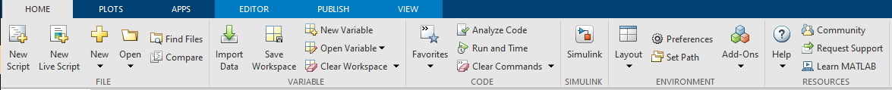
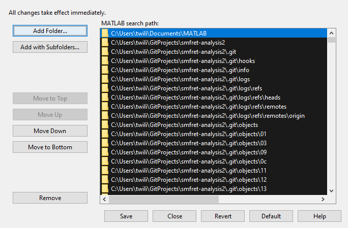

# smfret-analysis2

test-data from: 20201210MRS_mCaSR_D451TAG

# Installation

smfret-analysis2 needs to be added to matlabs path to fully function

To do this go to matlabs 'HOME' tab shown below

From this menu, select the 'Set Path' button in the ENVIRONMENT section.

It will open a new window shown below

Select 'Add with Subfolders...' and navigate to the smfret-analysis2 folder and click select folder.

Click Save.

# Execution

In the root smfret-analysis2 folder there are three files. 

## select_traces.m
select_traces.m handles all particle selection and works with the film.traces, film.pks, and film.tif files. It will display the particle for the trace you are examining. This takes the place of the old histogram_manual_range_three_forXC_new_gamma.m file.

Instead, it will now ask you if you wish to subtract background from your donor and acceptor values. If you select no, it will still have you select the background, but it will not subtract it. This lets you subtract or add it back later if you choose. 

The script no longer does anything with gamma, and instead there is a logical variable in its place that keeps track of whether or not you have subtracted background or not.

## create_histogram.m
create_histogram.m is what you run to smooth the FRET histograms and generate the normalized histogram as well as the cross-correlation data. It takes the place of the old smoothingFRET_XC_loop_gamma.m file.

It saves a new file titled "skipped-traces.csv" that keeps track of the file names for any particles you skip. This will greatly help with reproducibility if data needs to be re-analyzed.

## FretTraceHeatmap.m
FretTraceHeatmap.m is still under development, but it will generate a heatmap for all FRET traces in a folder and is useful for determining if your particles are dynamic or if there are subsets stuck in a particular FRET range.